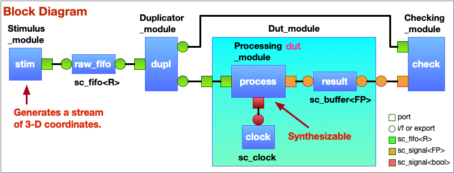

<!-- @file README.md -->
<!-- For doxygen --> \mainpage
#Project

Illustrate various C++11/14/17 techniques with SystemC 2.3.2. This project is hosted on github at https://github.com/dcblack/ModernSystemC.git .

## Design

A simple design was chosen to illustrate a variety of features. Basically a processing module takes a 3-D vector (x, y, z) coordinate and outputs the magnitude. Fixed-point numbers are demonstrated.

Key features of C++ that are illustrated include:

- Uniform initialization, std::initializer_list
- std::unique_ptr, std::valarray, std::default_random_engine
- for-each loop
- auto type inference
- Explicit default implementation
- Override safety
- User-defined literals (sc_time)

Verification features include:

- Random input
- Objection mechanism to determine end of simulation
- Checking error counts for PASS/FAIL determination

## Block diagram



## How to run

Assumes C++ compiler with support for C++14 or newer and SystemC
2.3.2 or newer pointed to by `$SYSTEMC_HOME`.

Build and execute with the `build` script:

```sh
build -run -- -d
```

Alternately, do it by hand:

```sh
mkdir -p build
pushd build
rm -f *.log
cmake .. 2>&1 | tee build.log
make docs 2>&1 | tee -a build.log
make modern 2>&1 | tee -a build.log
env LD_LIBRARY_PATH=$SYSTEMC/lib* ./modern 2>&1 | grep -v ^$ | tee run.log
popd
```

<!--///* The end *///-->
